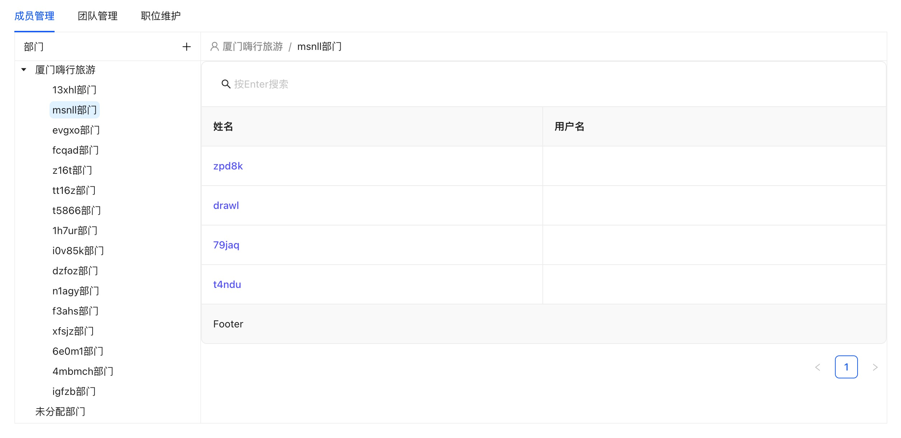

# Hixtrip FE Online

## 准备

- fork 此仓库
- 根据如下要求实现相关代码
- 完成要求
  - 提交`pull request`
  - 提供页面截图

## 需求

1. 目前已经有`src/api/user.ts` 以及 `src/api/org.ts` 两个 API
2. 需要实现如下效果界面：


> 功能要求：
- 不限 ```React``` 或者 ```Vue```
- 需要拆分 `OrgTree` 以及 `UserTable` 两个组件
  - 两个组件自己维护相关的数据。
  - 体现两个组件的互相通信。
- 组织架构根据点上级节点进行查询子级节点实现异步加载。
- 用户 ```Table ``` 数据跟据点击 ```组织架构树形节点``` 以及 ```输入搜索关键字``` 查询。
  - 需要考虑防抖节流等功能点
- 风格不限
  - 示例图仅仅是效果展示，不需要完全符合。
  - 可以使用 ```UI Framework```, 如 ```ant-design```, ```element-ui```等
  - 如果不用```UI Framework```, 可以直接用原生的```<ul> <li>```, ```<table>``` 实现，不用实现相关的CSS样式, 可以加分。

## 其他简答题

### 如何将如下的`JSON`正确解析成 `Object`
```json
{
  "userId": 111323290434354540545
}
```
A:
const jsonString = '{"userId": 111323290434354540545}';  
const obj = JSON.parse(jsonString); 
### 前端需要*稳定*每隔`1s`向服务端请求`API`, 请问如何实现？
A:在前端实现每隔1秒向服务端请求API的功能，你可以使用JavaScript的setInterval方法。需要注意的是，如果服务端响应较慢，或者网络状况不佳，可能会导致请求堆积，进而引发性能问题。在实际开发中，你可能需要考虑一些额外的逻辑来处理这种情况，比如使用防抖（debounce）或节流（throttle）技术来限制请求的频率，或者在每次新的请求发起之前取消前一次的请求等。

### 什么情况下，你会为你的项目引入状态管理库，比如`Redux`, `Pinia`, 可以简述一下起到了什么作用么？

A:在以下情况下，我会考虑为项目引入状态管理库，如Redux、Pinia等：

跨组件状态共享需求：当多个组件需要共享状态数据时，状态管理库能提供一个集中的存储位置，使得组件可以方便地访问和修改这些状态。这样可以避免通过props层层传递状态的繁琐过程，提高代码的可读性和可维护性。
复杂的异步操作：项目中经常涉及复杂的异步操作，如API请求。状态管理库可以很好地处理这些异步逻辑，确保在数据加载、更新或出错时，组件能够得到正确的状态更新。
状态变更追踪：随着项目的增长，状态的变更可能会变得难以追踪。状态管理库提供了一种结构化的方式来组织和管理状态，使得状态的变更更加可预测和易于调试。

### 为什么`ESM`与`CJS`不能兼容？

A:ESM（ECMAScript Modules）和CJS（CommonJS）不能兼容的原因主要源于它们之间的设计和实现方式的本质差异。
首先，ESM是JavaScript语言标准的模块系统，通过import和export语句进行。CJS是Node.js早期采用的模块系统，通过require和module.exports语句进行。这两种模块系统在语法和行为上有着显著的不同，导致它们很难在同一个环境中完全兼容。

### 完成页面截图


